<p align="right"><strong>English</strong> · <a href="README.zh-CN.md">中文</a></p>

# Review Evidence Workflow

**For research teams preparing full texts, developing a codebook, or coordinating human screening, appraisal and extraction—with source evidence and traceable decisions.**

A reusable agent skill for full-text screening, appraisal and extraction. Humans develop the rules; AI prepares evidence and proposals; reviewers verify or code independently in a browser. Send each person a package, receive their JSON, then resolve differences with the evidence in view.

**New visual edition:** [Watch with Belle](docs/watch/README.md) — a lighter 16:9 presentation and chapter player, in English and Chinese. The original edition is retained.

**First time here? [Watch the five-minute introduction](docs/intro/README.md)** to see how PDF Retrieval and Review Evidence Workflow connect, what to provide, and where people participate. English and Chinese editions are available.

**[When to use it](#is-this-for-your-review) · [Start here](#how-do-i-start) · [Follow the illustrated story](docs/story/README.md) · [Try the runnable demos](#try-it) · [Explore the two cases](#two-cases-one-reusable-workflow) · [See the workflow](#how-humans-stay-in-the-loop) · [Read the guide](review-evidence-workflow/references/getting-started.md)**

## Is this for your review?

Use it when a literature review needs **explicit coding rules, source-linked judgments or coordinated reviewer feedback**. It supports primary-study reviews and review-level projects such as meta-reviews. Start at your current stage; you do not have to run the entire workflow.

| Your current situation | Start here—and receive |
|---|---|
| A study list, with missing or uncertain PDFs | Retrieve/check full texts → matched-source manifest and unresolved queue |
| A codebook still being developed | Use your draft and chosen sample → blank calibration packages for people to develop the rules |
| Usable rules and PDFs; another batch to code | Prepare source-linked AI proposals for human verification, or independent blank packages |
| Different people need different tasks | Assign records, fields, instructions and modes → one package per reviewer |
| Feedback has returned, or rules/sources changed | Compare compatible returns, or identify affected work → decisions for people to resolve and a new round where needed |

**Bring what you have:** your research question, study list, current protocol/codebook (a draft is fine), available PDFs and any prior project/returns. Tell the agent which stage you want help with. Missing PDFs or an unfinished codebook do not prevent source preparation; coding awaits usable human-led rules and the relevant evidence.

### How do I start?

1. **Coordinator:** [install the skill](#try-it), start a new agent session, and supply your current materials. You can describe the task in ordinary language; the agent prepares the configuration.
2. **Reviewers:** receive their personal package, open `OPEN_ME.html`, review the evidence, and export JSON to return. They need a browser, not Python or an AI account.
3. **Team:** give the agent the returns and matching project. It checks versions/coverage and organizes differences; people adjudicate and authorize the result.

**Copy this first request:**

> Use $review-evidence-workflow. Here are our research question, study list, draft codebook and available PDFs. We are still calibrating our rules. First check the sources and identify gaps; then use our chosen sample and current definitions to prepare separate blank reviewer packages. Tell us what to do next and which decisions remain with our team.

Just want to explore first? [Try a fictional package](docs/TRY_DEMOS.md) without supplying research data. Need another starting point? [Copy a stage-specific prompt](review-evidence-workflow/references/getting-started.md).

The agent prepares **source manifests, reviewer packages, comparison reports and a decision ledger**. People develop the codebook and make scientific decisions. Coordination uses local files; the workbench does not provide shared cloud accounts. For a one-off paper summary, a simpler reading task is usually enough.

## Missing full texts? Prepare the sources first

The agent tries available sources, then adapts to failed routes and your institutional access. When login, MFA or manual saving is needed, it gives you a specific page and action. Returned files are checked for identity, version and completeness before review.

The independent **[Literature PDF Retrieval skill](https://github.com/Beeeeeeelle/literature-pdf-retrieval)** explains retrieval strategies, example prompts and human handoffs. Existing PDFs can go straight to checking; unresolved sources retain reasons. A downloaded file is not automatically a confirmed source.

## Watch the real workbench in use

**[▶ Real Pilot walkthrough — English / 中文](docs/demo/README.md)**: excluded and included reports, four coding stages, Correct/Revise, source-page jumps, quotation highlights, resizing and zoom.

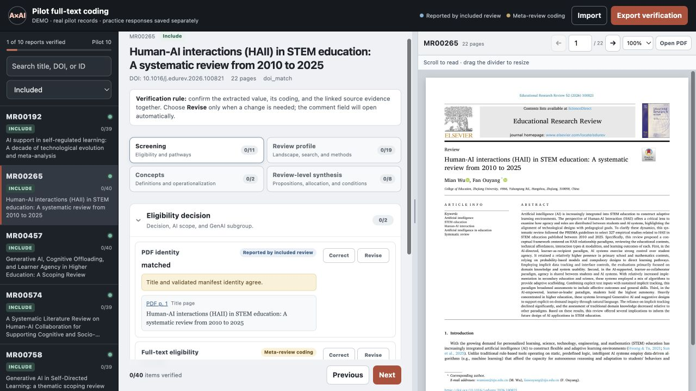

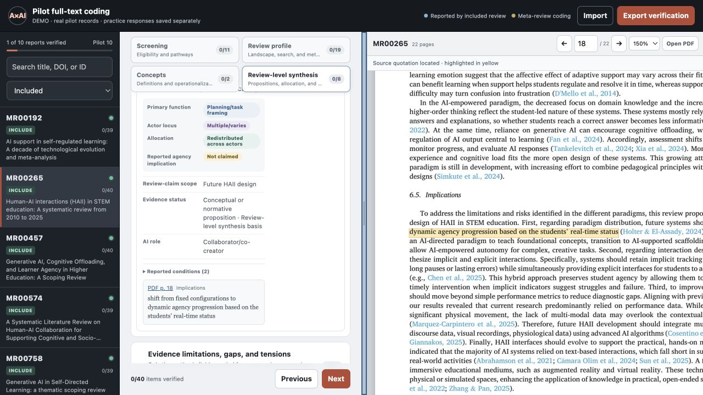

This is the original Agency project UI, with demonstration responses saved separately. The videos combine genuine browser captures and synthetic English or Chinese narration. The comet panels below explain the method; [synthetic portable examples](docs/TRY_DEMOS.md) provide practice.

## Follow Belle through a review

A team begins with scattered papers and developing rules. Follow Belle through six scenes to see how the skill prepares the work, where people judge, and what happens when something changes.

| 01 · Start with a question | 02 · People develop the rules |
|---|---|
| [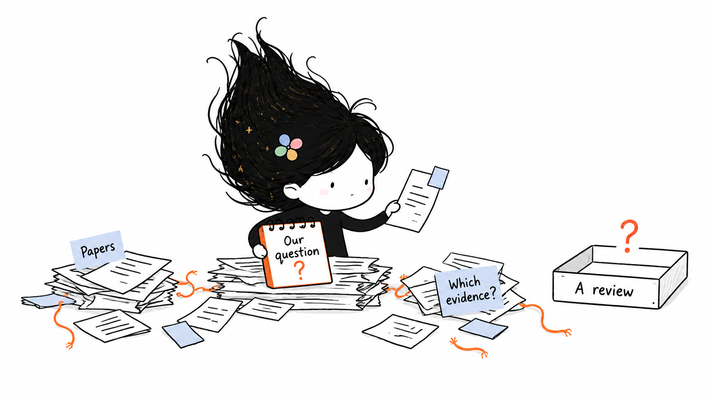](docs/story/README.md) | [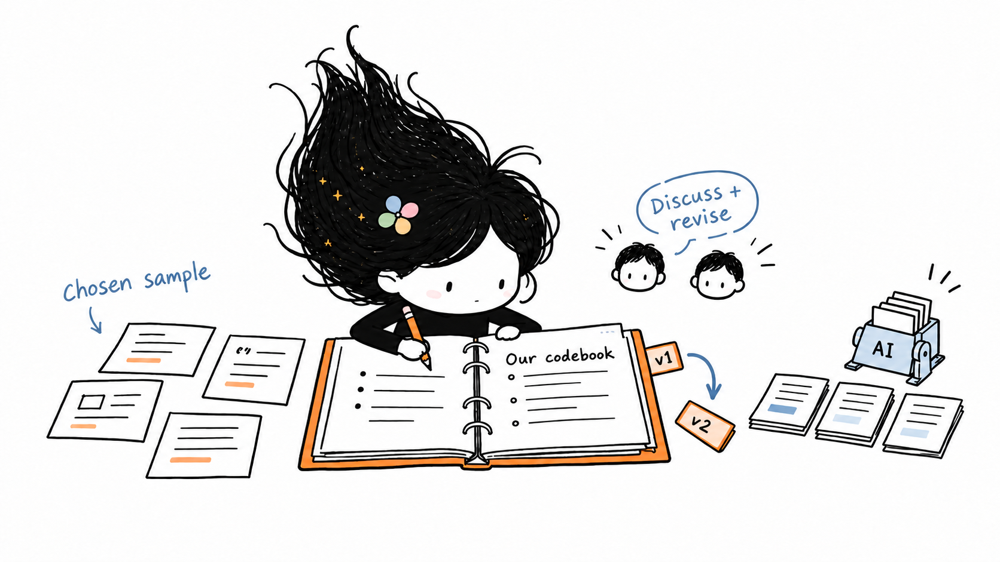](docs/story/README.md) |

| 03 · Check the full text | 04 · Choose how to review |
|---|---|
| [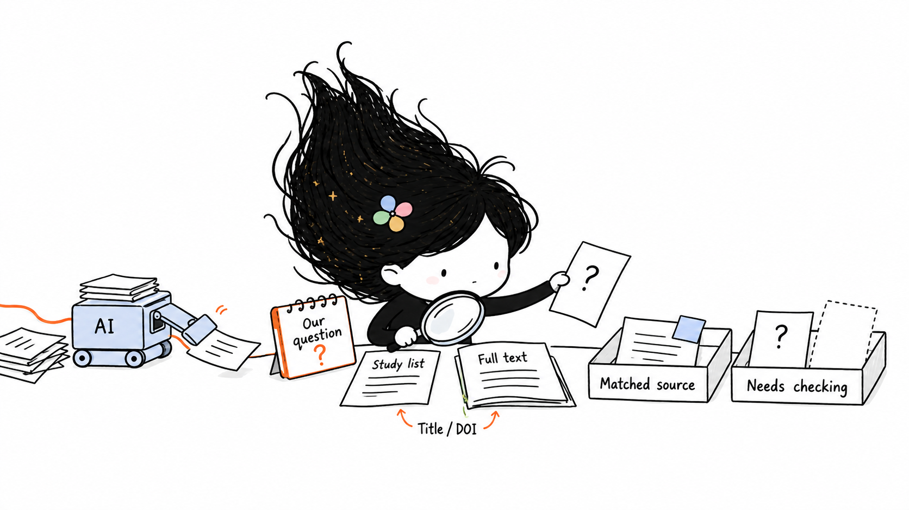](docs/story/README.md) | [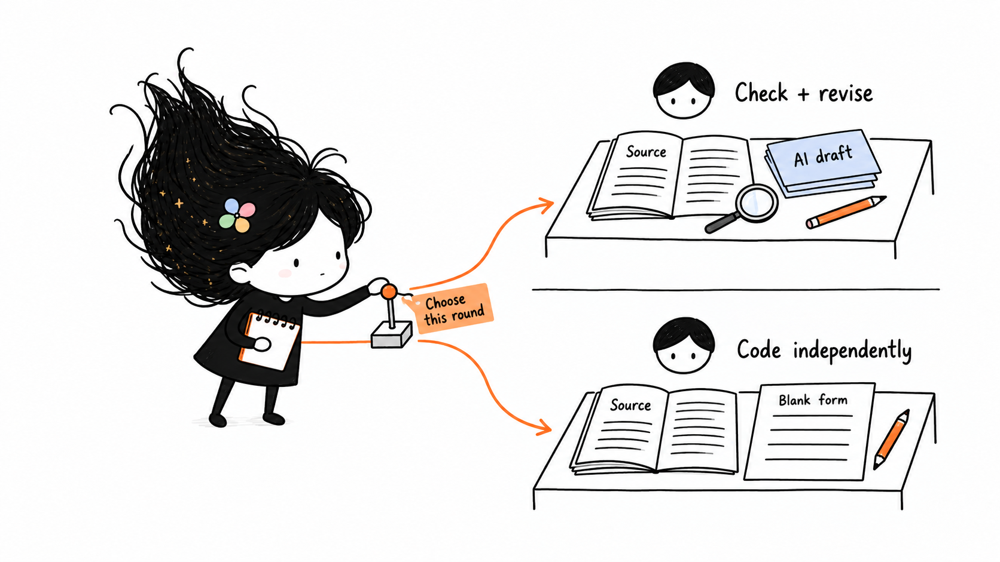](docs/story/README.md) |

| 05 · Return and resolve | 06 · Revisit and reuse |
|---|---|
| [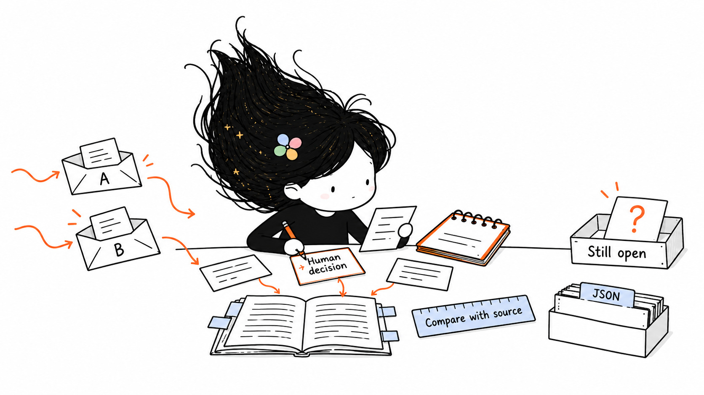](docs/story/README.md) | [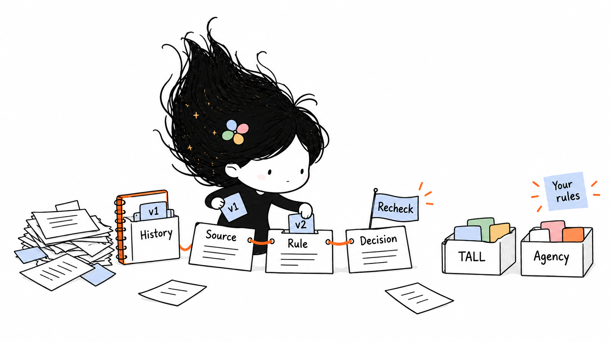](docs/story/README.md) |

**[Read the illustrated story →](docs/story/README.md)** Each scene has a short explanation and a link to the real workflow. These are conceptual illustrations; the workbench above is the actual application.

## Two cases, one reusable workflow

The cases show why the skill exists and what changes when the research unit changes. Click either image for its walkthrough.

| TALL · primary studies | Agency · reviews of research |
|---|---|
| [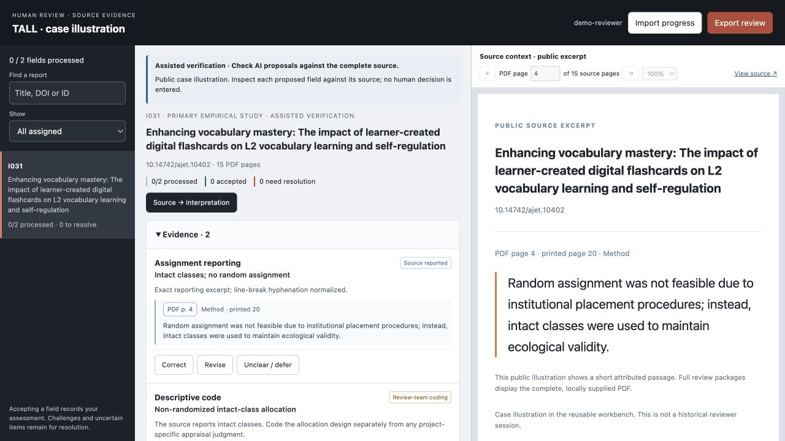](docs/cases/tall.md) | [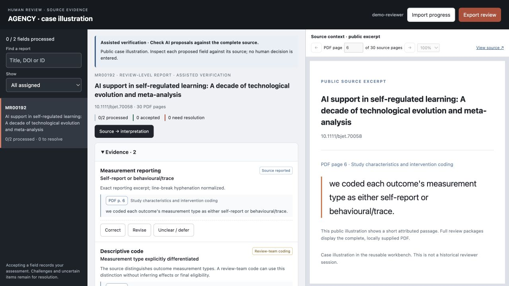](docs/cases/agency.md) |
| **What happens after a human changes a judgment?** A retained appraisal revision changes a project gate while screening remains Include. The case motivates explicit versions and review of affected work. | **What did the source say, and what did we infer?** A review's reported measurement types are kept separate from team coding and later cross-review synthesis. |
| Historical implementation in technology-assisted L2 learning. | Pilot adaptation for AI-supported education and learner agency. |
| [Read the TALL case →](docs/cases/tall.md) | [Read the Agency case →](docs/cases/agency.md) |

*Case images render real source material in the reusable v1.1 workbench. The public source pane uses attributed excerpts. These are illustrative adaptations, not historical reviewer-session screenshots. [Image provenance](docs/images/PROVENANCE.md).*

| What differs | TALL | Agency |
|---|---|---|
| Unit being coded | Original empirical study | Review report |
| Appraisal rule | Project-specific MMAT Q2/Q4 gate | 11 JBI items; no automatic numerical exclusion |
| Main reasoning boundary | Eligibility, appraisal and extraction membership | Source wording, descriptive coding and synthesis |
| Evidence status | Retrospective implementation case | Implemented pilot; synthesis still to follow |

**What transfers:** PDF checks, source-linked fields, configurable UI, separate reviewer returns, human adjudication and version tracking. **What you define again:** eligibility, codebook, appraisal rules, unit of analysis and review coverage. These are two motivating cases, not two equivalent completed validation experiments.

## How humans stay in the loop

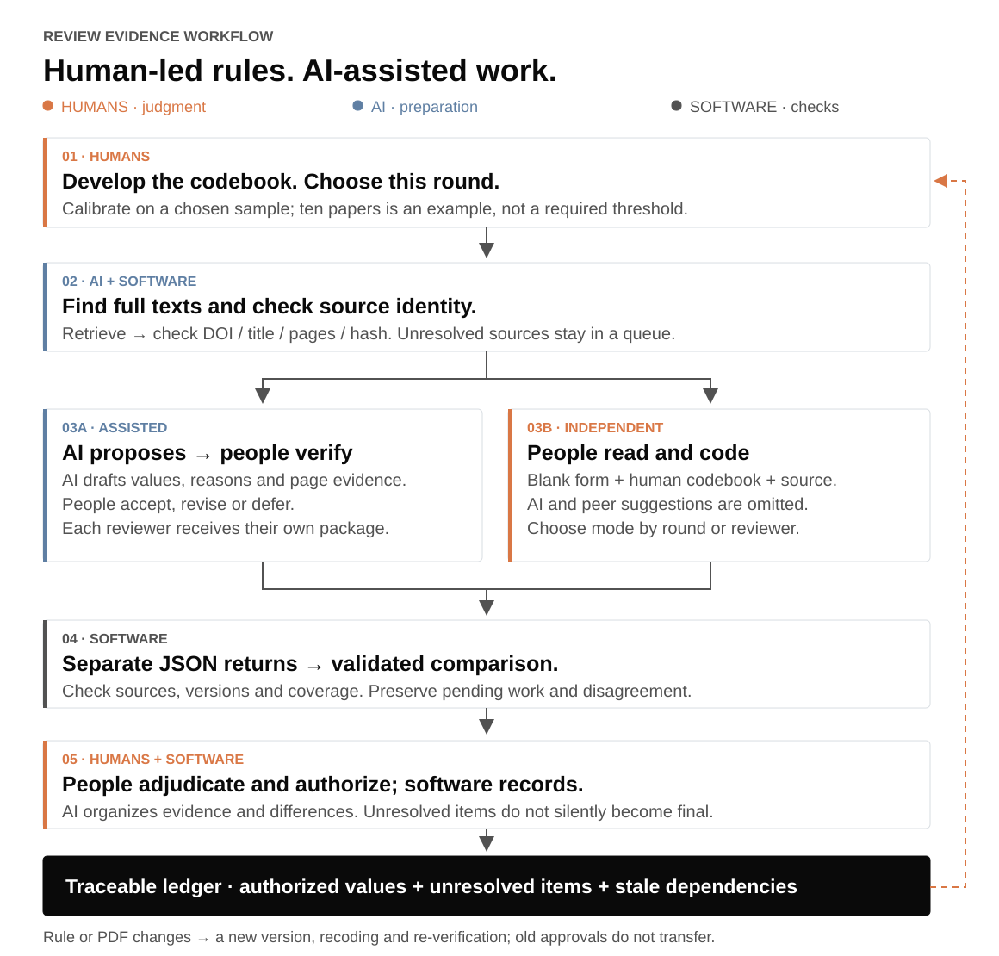

| Stage | AI and software help with | People are responsible for |
|---|---|---|
| Scope and calibration | Map supplied rules to fields; expose missing definitions | Develop and revise the codebook; choose sample and round |
| Full texts | Locate lawful copies; check identity, completeness and file versions | Provide access when needed; resolve ambiguous sources |
| Review | Prepare grounded proposals or blank forms; personalize assignments | Read sources; verify or independently code; explain uncertainty |
| Returns and decisions | Check versions/coverage; align differences; retain a decision record | Resolve disagreements and authorize the current result |
| Revisions | Flag registered dependencies after changes; prepare affected work | Decide what needs recoding, rechecking or a revised conclusion |

Start with ten papers, five, or another useful sample. Continue with AI coding plus human verification, add an independent round, or revisit calibration. **The sample size, number of rounds and appraisal threshold are project choices.** AI does not invent human approvals or make final scientific decisions. Registered dependencies can be flagged; undeclared relationships still need human review.

## Two review modes—and your own UI settings

| | Assisted verification | Independent review |
|---|---|---|
| Visible material | AI proposal, reason, evidence and original PDF | Human codebook, original PDF and blank form |
| Reviewer action | Correct / Revise / Unclear, with reasons | Enter value, rationale and source locations; save or defer |
| Package contents | Assigned proposals | AI suggestions and peer feedback omitted from the data |
| Useful when | Applying calibrated rules to another batch | People should code before seeing suggestions |

<details>
<summary><strong>See the independent mode</strong> — the same workbench with blank answers</summary>

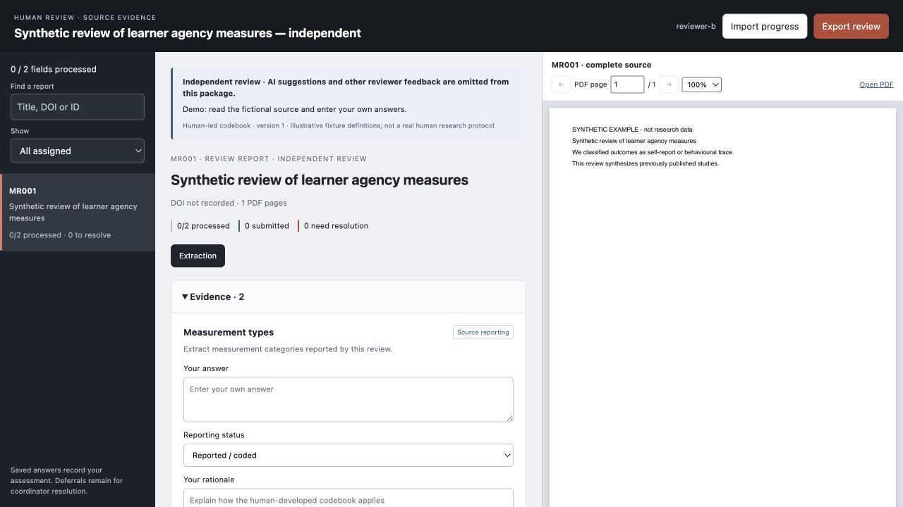

*The same synthetic example, assigned to a different reviewer. Independent packages support independent conduct; software cannot remove prior exposure to suggestions or prove reviewer independence.*

</details>

The agent can configure **records, fields, order, stages, groups, labels, instructions, mode and coverage requirements** per round or reviewer. Settings are supplied through configuration files; there is no visual settings editor in v1.1. Reviewers receive their own package and return files to the coordinator. [Modes, settings and round transitions](review-evidence-workflow/references/rounds.md).

## Try it

**Just look around:** [download the synthetic examples from v1.2.0](https://github.com/Beeeeeeelle/review-evidence-workflow/releases/tag/v1.2.0), unzip, and open a package's `OPEN_ME.html`. The release includes three fictional projects in both modes. If your browser restricts local files, follow the [local-server instructions](docs/TRY_DEMOS.md).

**Install the skill:** clone or download this repository, then copy its `review-evidence-workflow` folder to your Codex skills directory (`~/.codex/skills/` in the environment used for this release). Preserve any existing folder with that name. Start a new session and invoke `$review-evidence-workflow`.

```bash
git clone https://github.com/Beeeeeeelle/review-evidence-workflow.git
cd review-evidence-workflow
python3 examples/make_examples.py --out /tmp/review-workflow-demo --render-pages
```

Use a new output directory. Try `primary-study-assisted/OPEN_ME.html` or `review-level-independent/OPEN_ME.html` inside it: save an answer, export JSON and import it again.

**Coordinator requirements:** Python 3.9+ and Poppler for PDF checks/text/page rendering (`brew install poppler` or `sudo apt-get install poppler-utils`). Python helpers use the standard library. A verified-source package can use the browser PDF viewer without rendering. Cross-host agent runtime support has not been verified.

**Source preparation is an optional starting point.** Use the standalone PDF skill above, or bring existing files and use the included checking path. Fictional examples need no institutional account or paid API key. [Source handoff and unresolved queue](review-evidence-workflow/references/pdf-handoff.md).

## What can I ask the agent?

**Develop rules with people**

> Use $review-evidence-workflow. Our team is developing a codebook on this pilot sample. Make separate blank packages with our current definitions. Omit AI suggestions and other reviewers' feedback; compare our returns before we revise the rules.

**Apply rules and verify**

> Our team has calibrated codebook v2. Apply it to the remaining PDFs. Assign methods and measures to reviewer A, other fields to reviewer B, and prepare source-linked verification packages. Keep uncertain cases visible.

**Resume after feedback**

> These are the returned JSON files. Check versions and coverage, show disagreements with their source evidence, and list what needs our decision before producing the authorized ledger.

[More sample prompts, reviewer instructions and troubleshooting](review-evidence-workflow/references/getting-started.md).

## What has been checked?

**40 distinct automated tests**, local Python 3.9/3.12 checks, a fresh-context workflow trial, browser interactions, and six synthetic packages across three domains. The [release-commit CI run](https://github.com/Beeeeeeelle/review-evidence-workflow/actions/runs/36187005213) also passed on Ubuntu/Python 3.11. [Validation record and limits](docs/VALIDATION.md).

These checks establish specific software behaviors, including mismatched-return rejection, independent-package omission, source replacement handling and unresolved-state preservation. They do not establish AI accuracy, universal scientific validity or measured time savings. The intended benefit is less manual preparation and easier verification; that efficiency claim still needs a comparative study.

## Explore or contribute

- [Skill instructions](review-evidence-workflow/SKILL.md) · [Data contracts](review-evidence-workflow/references/contracts.md) · [Human workflow](review-evidence-workflow/references/human-workflow.md)
- [Related tools and positioning](docs/RELATED_WORK.md): what already exists, what this workflow connects, and what remains to evaluate.
- [Diagram sources and screenshot provenance](docs/images/PROVENANCE.md)

```bash
python3 -m unittest discover -s tests -v
node --check review-evidence-workflow/assets/app.js
```

Keep contributed tests and examples synthetic. Include a minimal anonymized fixture and expected/actual result in bug reports. MIT covers the code, documentation and synthetic fixtures; third-party source excerpts retain their original rights. The license grants no rights to PDFs added to a project.

---

**AI in learning. Humans in charge.**
