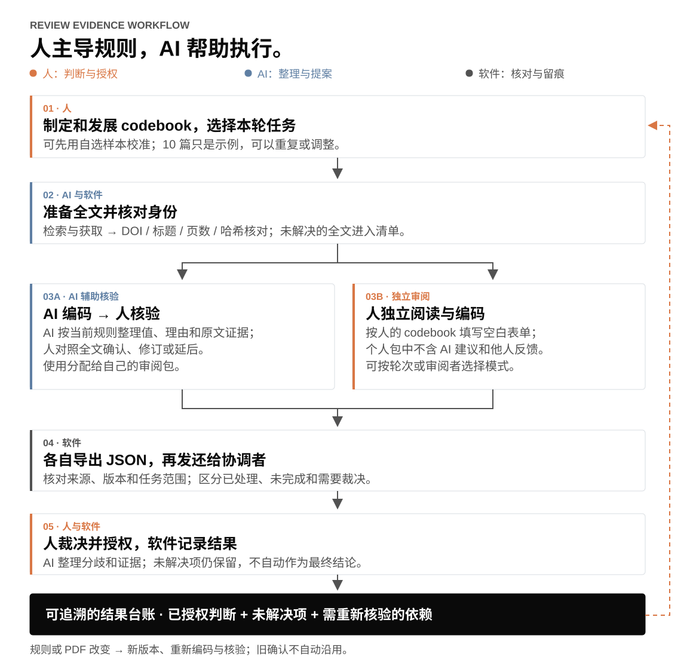

<p align="right"><a href="README.md">English</a> · <strong>中文</strong></p>

# Review Evidence Workflow

**当你的文献综述进入全文准备、codebook 校准、人工筛选、质量评价或信息提取阶段，用它组织证据与团队审阅，让每个判断有出处、每次修订有记录。**

这是一个支持全文筛选、质量评价和信息提取的可复用 agent skill。人制定和发展规则；AI 整理证据、提出编码建议；审阅者在浏览器中核验，或先独立编码。你发包，他们导出 JSON 发还，再由团队对照证据解决分歧。

**第一次接触？先看 [五分钟入门导览](docs/intro/README.zh-CN.md)**：从文献清单开始，认识找全文与组织审阅这两个 skill 怎样配合、要提供什么、哪些地方需要人参与。提供中英双版。

**[什么时候用](#什么时候用它) · [第一次怎么用](#第一次怎样开始) · [六幕故事图解](docs/story/README.zh-CN.md) · [试用示例](#怎样开始) · [看两个案例](#两个案例复用一套流程) · [看人机分工](#怎样让人持续参与判断) · [逐步使用指南](docs/README.zh-CN.md)**

## 什么时候用它？

当一项文献综述需要**按明确规则编码、逐项核对原文，或协调审阅者反馈**时，可以使用它。研究单位可以是原始实证研究，也可以是 meta-review 中的一篇 review。**从你当前的阶段开始即可，不必跑完整条流程。**

| 你现在的情况 | 可以从这里开始，并拿到什么 |
|---|---|
| 已有文献清单，但缺 PDF，或不确定是否找对 | 找全文、核对来源 → 已匹配的来源清单与待处理项 |
| 正在发展 codebook，还没定稿 | 用人的初稿和自选样本 → 独立空白校准包，交给人讨论和发展规则 |
| 已有可用规则和 PDF，准备处理下一批 | 按规则准备有出处的 AI 提案供人核验，或准备独立空白包 |
| 不同审阅者要做不同任务 | 分配文献、字段、说明和模式 → 每个人自己的审阅包 |
| 收到了反馈，或规则／PDF 有变化 | 比较对应版本的回传，或定位受影响工作 → 待人工裁决清单，必要时开启新一轮 |

**准备现有材料即可：** 研究问题、文献清单、当前 protocol/codebook（初稿也可以）、已有 PDF，以及上一轮项目和回传文件（如果有）。告诉 agent 你目前做到哪里、这次想完成什么。缺 PDF 或 codebook 尚未定稿时，可以先做来源准备；正式编码需要人提供本轮可用的规则与相应证据。

### 第一次怎样开始？

1. **协调者：** [安装 skill](#怎样开始)，开启新的 agent 会话，提供现有材料。用普通语言描述任务即可，配置由 agent 准备。
2. **审阅者：** 收到自己的包，打开 `OPEN_ME.html`，对照证据完成审阅，再导出 JSON 发还。只需要浏览器，不需要 Python 或 AI 账号。
3. **研究团队：** 把回传文件与对应项目交给 agent。它核对版本和覆盖、整理分歧；人裁决并授权结果。

**第一句话可以直接复制：**

> 用 $review-evidence-workflow。这是我们的研究问题、文献清单、codebook 初稿和已有 PDF。我们还在校准规则。请先核对来源并列出缺口，再用我们选定的样本和当前定义制作个人独立空白包。告诉我们下一步怎样做，以及哪些判断需要我们决定。

想先体验界面？[试用模拟包](docs/README.zh-CN.md#运行示例与本地预览)，不必提供真实研究材料。处在其他阶段？[选择对应的示例提问](review-evidence-workflow/references/getting-started.md)。

Agent 交付**来源清单、个人审阅包、分歧比较和决策台账**；codebook 与科学判断由人主导。协调通过本地文件完成，当前没有多人云端账号。如果只想读一篇论文、得到一次摘要，通常用普通精读任务即可。

## 缺全文？先把来源准备好

找 PDF 也是流程的一部分：AI 先尝试可用来源，再根据失败原因和你的学校访问条件调整路径。需要你登录、完成 MFA 或手动保存时，它会给出具体入口和操作；文件交回后，继续核对文章身份、版本和完整性，再进入审阅。

这一步由独立的 **[Literature PDF Retrieval skill](https://github.com/Beeeeeeelle/literature-pdf-retrieval/blob/main/README.zh-CN.md)** 详细说明，包含检索策略、使用示例与人机交接。已有 PDF 可以直接开始核对；未解决的来源会保留原因，不能用“文件已下载”代替“来源已确认”。

## 看真实工作台怎样运行

**[▶ 真实 Pilot 界面分步演示 · 中文／English](docs/demo/README.zh-CN.md)**：从排除与纳入，到四阶段编码、Correct／Revise、页码跳转、原文高亮和 PDF 拖动缩放。


这是实际 Agency 项目界面；演示反馈独立保存。视频使用真实操作后的截图序列，提供中英文合成解说。下面的彗星图解释方法；[通用模拟包](docs/TRY_DEMOS.md)用于练习。

## 跟着 Belle，走完一次 review

一个团队带着散落的文献和正在发展的规则开始研究。跟着 Belle 看六幕故事：skill 怎样准备工作，人在哪里判断，材料或规则改变后又怎样继续。

| 01 · 从一个问题开始 | 02 · 人发展规则 |
|---|---|
| [](docs/story/README.zh-CN.md) | [](docs/story/README.zh-CN.md) |

| 03 · 找到并核对全文 | 04 · 选择审阅方式 |
|---|---|
| [](docs/story/README.zh-CN.md) | [](docs/story/README.zh-CN.md) |

| 05 · 回传与裁决 | 06 · 回看与复用 |
|---|---|
| [](docs/story/README.zh-CN.md) | [](docs/story/README.zh-CN.md) |

**[展开阅读六幕图解 →](docs/story/README.zh-CN.md)** 每幕都有简短解释，并连接到实际操作。这里是概念插画，上方是实际工作台。

## 两个案例，复用一套流程

案例展示这个 skill 从哪里来，以及研究单位改变后，哪些东西要重新配置。点击图片可以看具体过程。

| TALL · 原始实证研究 | Agency · 对研究综述进行再综述 |
|---|---|
| [](docs/cases/tall.zh-CN.md) | [](docs/cases/agency.zh-CN.md) |
| **人的判断改了，后面的工作怎么办？** 保留记录中的一次质量评价修订改变了项目 gate，但筛选仍为 Include。这说明为什么需要明确当前版本，并检查受影响的工作。 | **原文说了什么，团队又解释了什么？** 将某篇 review 报告的测量方式、团队的描述性编码、后续跨 review 综合分开。 |
| 技术辅助二语学习中的历史实施案例。 | AI 支持教育与学习者 agency 的试点适配。 |
| [展开 TALL 案例 →](docs/cases/tall.zh-CN.md) | [展开 Agency 案例 →](docs/cases/agency.zh-CN.md) |

*案例图把真实来源资料呈现在可复用的 v1.1 工作台中，公开原文区显示带出处的短摘录。这是案例适配展示，并非历史审阅现场截图。[图片来源说明](docs/images/PROVENANCE.md)。*

| 区别 | TALL | Agency |
|---|---|---|
| 编码单位 | 原始实证研究 | Review 报告 |
| 质量评价规则 | 项目自己的 MMAT Q2/Q4 gate | 11 项 JBI 判断，不按总分自动排除 |
| 关键判断边界 | 纳入、质量评价、是否进入提取 | 原文报告、描述性编码、跨 review 综合 |
| 当前证据状态 | 回顾性的实施案例 | 已实施的试点，综合尚待继续 |

**可以复用：** PDF 核对、字段与原文关联、可配置 UI、个人回传、人裁决和版本记录。**由新项目重新制定：** 纳入标准、codebook、评价规则、分析单位和覆盖要求。这是两个有不同进度的案例，不是两个已经完成的同等验证实验。

## 怎样让人持续参与判断？



| 阶段 | AI 与软件帮助做什么 | 人负责什么 |
|---|---|---|
| 研究范围与校准 | 把已有规则映射为字段，指出缺失定义 | 制定、发展和修改 codebook，选择样本与轮次 |
| 全文准备 | 找合法可获取的全文，核对身份、完整性和文件版本 | 必要时提供访问途径，处理来源歧义 |
| 审阅 | 按规则准备有出处的提案或空白表单，分配个性化任务 | 阅读原文，核验或独立编码，说明不确定性 |
| 回传与决策 | 核对版本和覆盖，整理分歧，保留决策记录 | 解决分歧，授权当前结果 |
| 修订 | 标记已登记的依赖，准备受影响的工作 | 判断哪些编码、核验或结论需要重做 |

可以先做 10 篇、5 篇或其他合适的样本；再用 AI 编码加人核验，加入独立审阅，或回到校准。**样本量、轮次数和质量门槛都由项目决定。** AI 不代替人作出最终科学判断，也不生成虚假的人工确认。软件能标记已经登记的依赖关系，未登记的关系仍需人检查。

## 两种审阅模式，以及你自己的 UI 设置

| | AI 辅助核验 | 独立审阅 |
|---|---|---|
| 看到的内容 | AI 提案、理由、证据和原始 PDF | 人的 codebook、原始 PDF 和空白表单 |
| 人怎样做 | Correct / Revise / Unclear，填写理由 | 自己填写值、理由、原文位置，保存或延后 |
| 包内数据 | 本人获分配的提案 | 不含 AI 建议与他人反馈 |
| 适合何时 | 把校准后的规则应用于下一批文献 | 希望审阅者先形成自己的编码 |

<details>
<summary><strong>展开看独立模式</strong>：同一工作台，答案从空白开始</summary>


*同一模拟文献，分配给另一位审阅者。个人包可以支持独立作业，但软件无法消除审阅者过去接触建议的经历，也不能证明人的行为独立。*

</details>

Agent 可以按轮次或审阅者配置**文献、字段、顺序、阶段、分组、标签、说明、模式和覆盖要求**。v1.1 通过配置文件调整，尚无可视化设置编辑器。审阅者拿到自己的包，完成后发还文件。[模式、设置与轮次转换](review-evidence-workflow/references/rounds.md)。

## 怎样开始？

**先体验界面：** 从 [v1.2.0 release 下载模拟示例](https://github.com/Beeeeeeelle/review-evidence-workflow/releases/tag/v1.2.0)，解压后打开任一包的 `OPEN_ME.html`。其中有三类模拟项目，每类两种模式。若浏览器限制本地文件，参考[本地服务说明](docs/README.zh-CN.md#运行示例与本地预览)。

**安装 skill：** 下载或克隆仓库，将其中的 `review-evidence-workflow` 文件夹复制到 Codex skills 目录（本版本使用的环境为 `~/.codex/skills/`）。若已有同名目录，先保留旧版。开启新会话后使用 `$review-evidence-workflow`。

```bash
git clone https://github.com/Beeeeeeelle/review-evidence-workflow.git
cd review-evidence-workflow
python3 examples/make_examples.py --out /tmp/review-workflow-demo --render-pages
```

请使用新的输出目录。打开其中的 `primary-study-assisted/OPEN_ME.html` 或 `review-level-independent/OPEN_ME.html`，尝试保存、导出 JSON、再导入。

**协调端依赖：** Python 3.9+；用 Poppler 核对 PDF、提取文字或渲染页面（`brew install poppler` 或 `sudo apt-get install poppler-utils`）。Python 脚本只使用标准库。已有来源核验的包可以使用浏览器 PDF 查看器，不渲染页面。其他 agent 平台的运行兼容性尚未验证。

**全文准备是可选的入口。** 可以搭配上面的独立 PDF skill，也可以使用已有文件与包内核对路径。运行模拟示例不需要机构账号或付费 API key。[来源交接与待处理清单](review-evidence-workflow/references/pdf-handoff.md)。

## 可以直接怎样问？

**先由人发展规则**

> 用 $review-evidence-workflow。我们想用这批样本发展 codebook。按当前定义制作独立空白包，不含 AI 建议和他人反馈。等我们回传后，先比较，再由我们修改规则。

**让 AI 应用规则，人来 verify**

> 我们已经校准了 codebook v2。请处理其余 PDF，把方法和测量分给 A，其他字段分给 B，做成有原文定位的核验包。保留不确定项。

**收到反馈后继续**

> 这些是返回的 JSON。请核对版本和覆盖，把分歧与原文证据列在一起，说明哪些需要我们决定，再形成获授权的结果台账。

[逐步使用说明](docs/README.zh-CN.md) · [更多提问示例、审阅者说明与排错](review-evidence-workflow/references/getting-started.md)。

## 验证到了什么程度？

已完成 **40 项不同的自动测试**、本地 Python 3.9/3.12 检查、一次独立新上下文执行、浏览器交互检查，以及三个领域的六份模拟包。[发布提交的 CI](https://github.com/Beeeeeeelle/review-evidence-workflow/actions/runs/36187005213) 也在 Ubuntu/Python 3.11 通过。[完整验证记录与边界](docs/VALIDATION.md)。

这些检查验证了特定软件行为，例如拒绝版本不匹配的回传、独立包移除建议、更换来源后处理受影响字段，以及保留未解决状态。它们不等于证明 AI 准确率、所有综述都适用，或已经测得节省多少时间。减少准备工作、帮助人更快核验是设计目标，效率仍需比较研究来测量。

## 继续了解或参与改进

- [Skill 执行说明](review-evidence-workflow/SKILL.md) · [数据约定](review-evidence-workflow/references/contracts.md) · [人的工作流程](review-evidence-workflow/references/human-workflow.md)
- [相关工具与定位](docs/RELATED_WORK.md)：已有工作、这里连接的环节，以及还需验证的地方。
- [流程图源码与截图来源](docs/images/PROVENANCE.md)

```bash
python3 -m unittest discover -s tests -v
node --check review-evidence-workflow/assets/app.js
```

贡献测试和示例时请使用模拟资料；报告问题时提供最小匿名样例及预期、实际结果。代码、说明和模拟示例使用 MIT 许可；第三方原文摘录保留原权利。该许可不授予项目所用 PDF 的再分发权。

---

**AI in learning. Humans in charge.**
