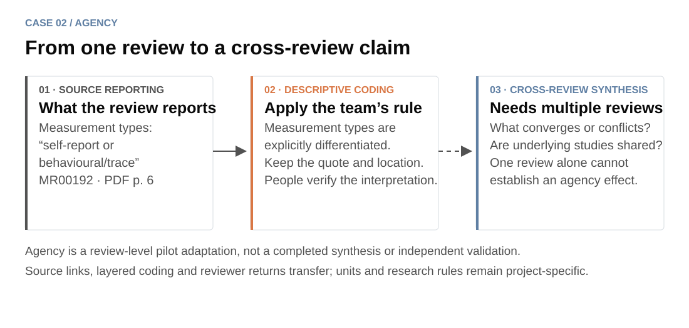

[← Project](../../README.md) · **English** · [中文](agency.zh-CN.md) · [← TALL case](tall.md)

# Agency: keep reporting, coding and synthesis separate

**The same review workbench can support a different research unit without carrying over TALL's scientific rules.**

Agency examines AI-supported educational learning and learner agency, with GenAI separately coded. Its unit is a review report, not a primary study. This is an implemented pilot adaptation; the cross-review synthesis and independent-review validation are not complete.

## See the layers in the workbench

*Real MR00192 source material rendered in v1.1 for illustration. The public source pane uses an attributed excerpt; complete PDFs remain in local review packages. This is not a historical reviewer-session screenshot and contains no entered human judgment.*

The source is [AI support in self-regulated learning: A decade of technological evolution and meta-analysis](https://doi.org/10.1111/bjet.70058). At PDF page 6, under “Study characteristics and intervention coding,” it distinguishes self-report from behavioural/trace measurement. The example adapter presents that reporting beside a proposed descriptive code: **measurement type explicitly differentiated**.

| Layer | What belongs here | What still needs human judgment |
|---|---|---|
| Source extraction | What this review reports, with quotation/page/context | Whether the passage and context support the extracted value |
| Descriptive coding | Apply the team's current codebook to that reporting | Whether the interpretation follows the rule; whether the rule needs revision |
| Cross-review synthesis | Compare propositions, overlap, convergence and discordance | What the combined evidence supports and where it remains uncertain |

A measurement-type passage does not by itself establish eligibility, a causal effect or an agency conclusion. The codebook also separates **actor locus**, **allocation movement** and **agency implication**: delegating a task to AI does not automatically mean that learner agency expanded or eroded.

## What changed from TALL?

- **Unit and fields:** reviews, search strategies, constructs and review-level propositions replace primary-study extraction fields.
- **Appraisal:** 11 item-level JBI judgments after inclusion; no automatic exclusion from a numerical total.
- **Synthesis:** review families and shared underlying studies need cross-source work. One PDF cannot populate the whole synthesis.
- **Human calibration:** people develop and revise the distinctions that the agent will later apply.

The mechanics transfer: source identity checks, page-linked proposals, personalized UI, separate returns, version checks and adjudication. The scientific rules do not transfer automatically.

## What has actually happened?

The documented pilot screened **10 reports** and provisionally coded **6 included reviews**. These are different denominators and a pilot snapshot, not proof that calibration or the final synthesis is complete.

The historical project codebook described a planned freeze condition involving joint verification of at least 10 included reviews. That was a project-specific prospective condition, not evidence that it happened and not a requirement of the reusable skill. A new team chooses its own sample and stopping criteria.

The protocol plans independent human screening and appraisal. The existing coauthor calibration packages expose AI proposals, so those packages demonstrate **assisted verification**. The reusable skill now also supports blank independent packages, but that capability does not establish completion of the protocol's independent work.

## Use the pattern in your own project

> Use $review-evidence-workflow. Our unit is a review report. Keep source wording, our descriptive coding and later synthesis separate. Prepare evidence-linked verification packages, and leave cross-review claims pending until the relevant sources and human decisions are available.

People remain responsible for the codebook, interpretation and synthesis. AI can prepare evidence and organize comparisons; software checks returned files and preserves versions. Source-linked suggestions are a means of supporting human review, not a substitute for it.

[Detailed case provenance and adapter rules](../../review-evidence-workflow/references/cases/agency.md) · [Image provenance](../images/PROVENANCE.md) · [Try a fictional review-level package](../TRY_DEMOS.md) · [Compare TALL →](tall.md)
