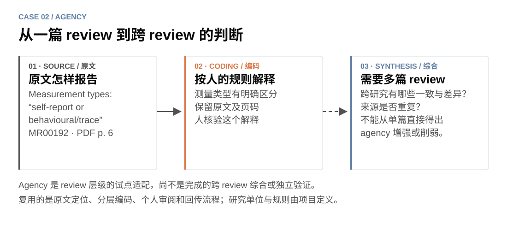

[← 项目首页](../../README.zh-CN.md) · [English](agency.md) · **中文** · [← TALL 案例](tall.zh-CN.md)

# Agency：分清原文、编码与综合

**同一工作台可以支持不同的研究单位，研究规则则需要重新制定。**

Agency 关注 AI 支持教育学习与学习者 agency，单独编码 GenAI。其单位是一篇 review 报告，不是原始研究。这是已实施的试点适配；跨 review 综合和独立审阅验证尚未完成。

## 在界面中看见三个层次

*真实 MR00192 来源资料在 v1.1 工作台中的案例适配展示。公开原文区使用带出处的短摘录，完整 PDF 留在本地审阅包。此图不是历史审阅现场截图，未填入人的判断。*

来源为 [AI support in self-regulated learning: A decade of technological evolution and meta-analysis](https://doi.org/10.1111/bjet.70058)。PDF 第 6 页 “Study characteristics and intervention coding” 区分了自我报告与行为／痕迹测量。案例适配把这项报告与一个描述性编码提案并排呈现：**测量类型有明确区分**。

| 层次 | 这里放什么 | 仍需人判断什么 |
|---|---|---|
| 原文提取 | 这篇 review 报告的内容、短摘录、页码与上下文 | 段落及上下文是否支持这个提取值 |
| 描述性编码 | 按团队当前 codebook 解释原文 | 解释是否符合规则，规则是否需要修改 |
| 跨 review 综合 | 比较命题、重叠来源、一致与差异 | 多篇证据共同支持什么，仍有哪些不确定性 |

测量方式的一段原文，不能单独决定最终纳入、因果效应或 agency 结论。Codebook 还区分了 **actor locus（行动主体）**、**allocation movement（任务／控制分配变化）**和 **agency implication（对能动性的意义）**：将任务交给 AI，不自动等于学习者 agency 增强或削弱。

## 相比 TALL，改了什么？

- **单位与字段：** 原始研究提取字段改为 review、检索策略、构念和综述层级命题。
- **质量评价：** 纳入后进行 11 项 JBI 判断，不按数值总分自动排除。
- **综合工作：** review 家族及共同使用的原始研究需要跨来源检查，一份 PDF 无法填完综合结论。
- **人的校准：** 人制定、发展和修订这些判断边界，AI 才能按当前规则继续处理。

可以复用的执行环节包括来源核对、页码关联、个人 UI、分别回传、版本检查和裁决。研究规则不会自动从 TALL 迁移过来。

## 已经做到了哪里？

记录中的试点筛选了 **10 份报告**，对 **6 篇暂定纳入的 review** 进行了编码。这是两个不同分母的试点快照，不代表校准或最终综合已经完成。

历史项目 codebook 规定过一个计划中的冻结条件：共同核验至少 10 篇纳入 review。那是该项目的前瞻条件，不是已经完成的证据，也不是这个可复用 skill 的统一要求。新团队可以自己选择样本与停止标准。

研究方案计划独立人工筛选和评价。已有合作者校准包显示 AI 提案，因此这些包实际展示的是 **AI 辅助核验**。通用 skill 现在也能生成独立空白包，但拥有这个功能，不代表方案中计划的独立工作已经完成。

## 怎样迁移到自己的项目？

> 用 $review-evidence-workflow。我们的单位是 review 报告。请把原文、描述性编码和后续综合分开，生成有证据定位的核验包。在相关来源和人的判断齐备之前，把跨 review 结论保持为待处理。

人负责 codebook、解释与综合；AI 准备证据、组织比较；软件核对回传并保留版本。有出处的建议用于支持人的审阅，不能代替人的判断。

[详细资料来源与项目规则](../../review-evidence-workflow/references/cases/agency.md) · [图片来源](../images/PROVENANCE.md) · [试用模拟 review 包](../TRY_DEMOS.md) · [比较 TALL →](tall.zh-CN.md)
