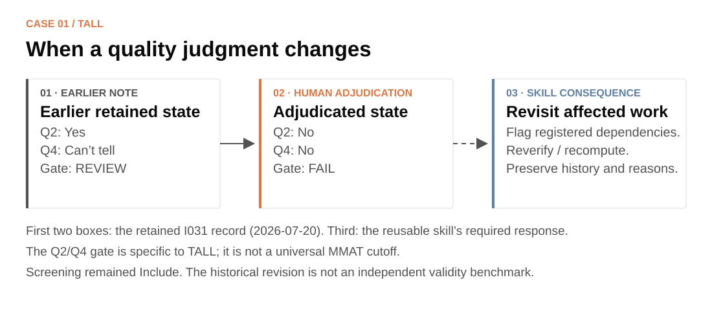

[← Project](../../README.md) · **English** · [中文](tall.zh-CN.md) · [Agency case →](agency.md)

# TALL: when a human judgment changes

**A primary-study review shows why source evidence, human corrections and the current decision version must stay connected.**

TALL concerns cognitive and metacognitive support in technology-assisted L2/foreign-language learning. Its unit is an original empirical study. This is a retrospective implementation case reconstructed from retained artifacts, not a new validation experiment.

## See the source-to-code interaction

*Real I031 source material rendered in the v1.1 workbench for illustration. The public source pane contains an attributed excerpt; full review packages use locally supplied complete PDFs. This is not a historical reviewer-session screenshot. No human judgment has been entered in this view.*

The example source is [Enhancing vocabulary mastery: The impact of learner-created digital flashcards on L2 vocabulary learning and self-regulation](https://doi.org/10.14742/ajet.10402). PDF page 4 (printed page 20) reports intact classes and the absence of random assignment. The workbench separates:

| Layer | Example | Why separate it? |
|---|---|---|
| Source reporting | Intact classes; no random assignment | Preserve what the article actually reports, with page/context |
| Descriptive coding | Non-randomized intact-class allocation | Make the team's interpretation visible and correctable |
| Appraisal | Apply the project's item definitions to the relevant evidence | A design label does not itself answer every quality question |

AI can prepare these fields, reasons and locations. A reviewer reads the complete source, accepts or challenges the proposed interpretation, and returns the result. The displayed passage illustrates source-linked coding; it is not sufficient on its own to justify all appraisal decisions below.

## A retained human revision

The I031 record contains an adjudication note dated **2026-07-20**. Screening stayed Include, while the appraisal values changed:

The first two boxes summarize a recorded historical change. The third describes the reusable skill's response to such a change; it is not a claim that every downstream manuscript change was traced in the historical project.

TALL used a **project-specific** gate: Q2 and Q4 both Yes → PASS; either No → FAIL; uncertainty → REVIEW. That mapping is not a universal MMAT rule and must not become the default for other reviews. Under TALL's rules, an eligibility inclusion did not automatically permit extraction after a failed appraisal gate.

Earlier prose retained the REVIEW state while structured fields held FAIL. This makes version governance tangible: preserve the earlier rationale, identify the current authorized value, then inspect extraction membership, counts or claims that depend on it. A logged revision demonstrates human intervention; it does not establish objective correctness against an independent benchmark.

## Who does what?

| People | AI assistance | Software |
|---|---|---|
| Define eligibility and the codebook; read sources; challenge proposals; adjudicate | Apply the current rules; locate evidence; organize differences and affected work | Bind returns to versions and sources; track coverage; record decisions; flag registered dependencies |

The historical UI exposed AI proposals and field-level OK/Wrong controls with comments. The released reusable UI uses Correct / Revise / Unclear. Neither visible-proposal verification nor agreement with it should be reported as independent reviewer agreement or AI accuracy.

## Reuse it in another review

Keep the source links, separate proposals and human responses, personalized packages, returned-file checks and decision history. Replace the L2 scope, eligibility criteria, construct taxonomy, appraisal mapping and extraction fields with your own human-developed rules.

> Use $review-evidence-workflow. Our team has revised an appraisal judgment. Preserve the earlier version, identify registered fields and outputs that depend on it, and prepare the affected records for human re-verification under our current codebook.

**Evidence boundary:** this case supports the need for correctable judgments and explicit versions. It does not measure time savings, independently validate the appraisal, or show that every historical released claim had a complete dependency map.

[Detailed case provenance and adapter rules](../../review-evidence-workflow/references/cases/tall.md) · [Image provenance](../images/PROVENANCE.md) · [Try a fictional primary-study package](../TRY_DEMOS.md) · [Compare Agency →](agency.md)
