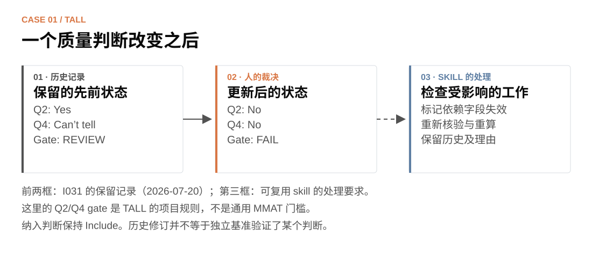

[← 项目首页](../../README.zh-CN.md) · [English](tall.md) · **中文** · [Agency 案例 →](agency.zh-CN.md)

# TALL：人的判断改变之后

**原始研究的审阅案例说明：原文证据、人的修订、当前生效的判断版本，需要连在一起。**

TALL 关注技术辅助二语／外语学习中的认知和元认知支持，编码单位是原始实证研究。这里回顾的是保留资料中的历史实施过程，不是新开展的验证实验。

## 从原文到编码，界面怎样呈现？

*真实 I031 来源资料在 v1.1 工作台中的案例适配展示。公开原文区使用带出处的短摘录；完整审阅包使用本地提供的全文 PDF。此图不是历史审阅现场截图，未填入人的判断。*

来源为 [Enhancing vocabulary mastery: The impact of learner-created digital flashcards on L2 vocabulary learning and self-regulation](https://doi.org/10.14742/ajet.10402)。PDF 第 4 页（印刷页码 20）报告使用完整班级，未进行随机分配。工作台将这些内容分开：

| 层次 | 示例 | 为什么分开？ |
|---|---|---|
| 原文报告 | 完整班级；没有随机分配 | 保留论文报告了什么，以及页码和上下文 |
| 描述性编码 | 非随机的完整班级分配 | 让团队的解释可见、可修订 |
| 质量评价 | 按项目的条目定义审视相应证据 | 研究设计的标签不能直接回答所有质量问题 |

AI 可以准备字段、理由和原文位置。人阅读全文，确认或挑战这个解释，再回传判断。展示的段落用于说明原文与编码怎样关联，不能单独证明下面所有质量评价修订。

## 保留记录中的一次人工修订

I031 的记录有一条 **2026-07-20** 的裁决说明：筛选仍为 Include，质量评价发生变化。

前两框来自历史记录；第三框是可复用 skill 遇到这种变化时应有的处理，不表示历史项目的每一处后续论文改动都已追踪。

TALL 使用自己的项目规则：Q2、Q4 都为 Yes 时 PASS；任一为 No 时 FAIL；不确定时 REVIEW。**这不是通用 MMAT 门槛**，不能自动套用到其他 review。依照 TALL 的规则，筛选纳入不代表质量 gate 失败后仍可以进入提取。

保留的早期文字仍描述 REVIEW，而结构化字段已为 FAIL。这里能具体看见版本管理的必要性：保留早期理由，明确当前获授权的值，再检查依赖它的提取范围、计数或结论。修订记录说明人确实介入过，不等于独立基准已经验证哪一个判断客观正确。

## 人、AI、软件各自做什么？

| 人 | AI 帮助 | 软件 |
|---|---|---|
| 制定纳入标准与 codebook；阅读原文；挑战提案；裁决 | 应用当前规则，定位证据，整理分歧与受影响的工作 | 绑定回传与版本、来源；检查覆盖；记录决策；标记已登记的依赖 |

历史 UI 显示 AI 提案，以字段级 OK/Wrong 和评论收集反馈。发布的通用 UI 使用 Correct / Revise / Unclear。看过提案后的核验及其一致率，都不能写成独立审阅者一致性或 AI 准确率。

## 换一项 review，复用什么？

保留原文定位、提案与人的响应分开记录、个人审阅包、回传核对和决策历史。二语研究范围、纳入标准、构念分类、评价规则与提取字段，换成新团队制定的规则。

> 用 $review-evidence-workflow。我们修改了一项质量判断。请保留原版本，找出已登记、依赖它的字段与输出，按当前 codebook 准备受影响记录，交给人重新核验。

**证据边界：** 这个案例说明可修订判断和明确版本的必要性；它没有测量提速，没有独立验证质量评价，也不代表所有历史论文结论都已经建立完整依赖关系。

[详细资料来源与项目规则](../../review-evidence-workflow/references/cases/tall.md) · [图片来源](../images/PROVENANCE.md) · [试用模拟原始研究包](../TRY_DEMOS.md) · [比较 Agency →](agency.zh-CN.md)
