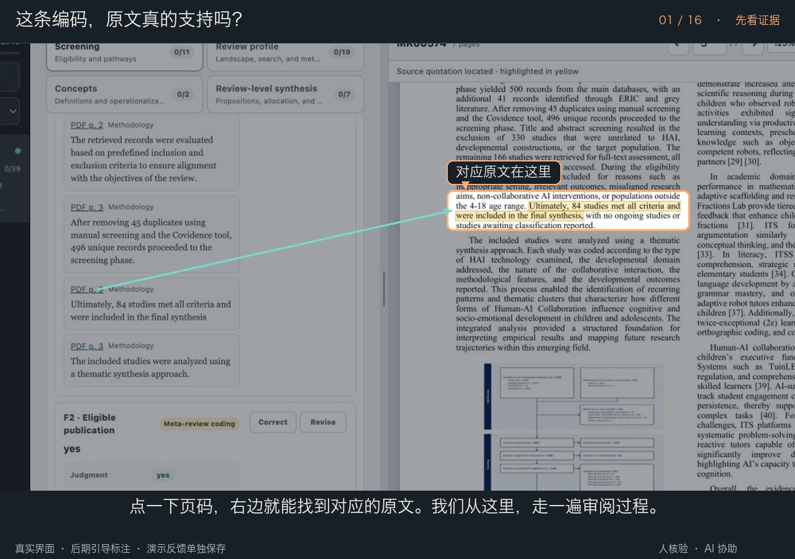
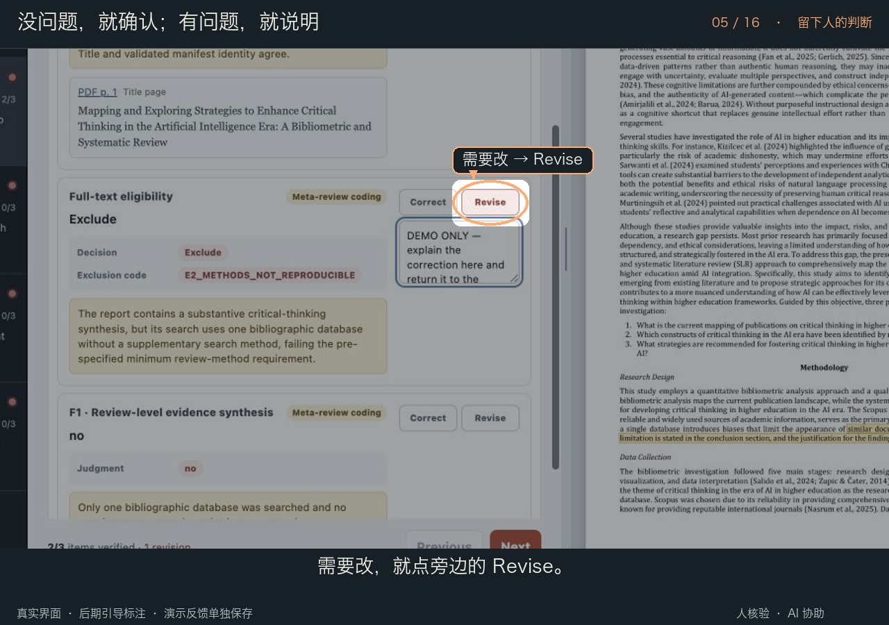

# 这条编码，原文真的支持吗？

这里展示的是 Belle 实际使用的 **Pilot full-text coding** 界面、真实项目编码提案和对应 PDF。此前的黑色彗星图是概念插画；通用试用包使用模拟资料。它们与这里的真实界面演示分别标注。

**[▶ 中文操作导览 · 3:36](pilot-guided-walkthrough.zh-CN.mp4)** · [直接下载](https://github.com/Beeeeeeelle/review-evidence-workflow/releases/download/v1.2.0/pilot-guided-walkthrough.zh-CN.mp4) · [English video · 3:40](README.md)

第一次认识这套流程？先看 **[两个 skill 的五分钟入门导览](../intro/README.zh-CN.md)**，再回到这里了解具体按钮。已有的中文操作视频保留，英文版使用同一批真实画面，配有英文解说、标注与独立计时的字幕。

跟着一篇文献，看看怎样找证据、留下判断，再把反馈交回团队。新版约 **3 分 36 秒**，把过程分成 16 章、35 个讲解步骤，配有更口语化的中文解说、合成配音和同步字幕。

**橙色圈框**告诉你现在看哪里，**青色箭头**把证据页码与原文连起来，按钮和说明框会局部放大。**黄色引文高亮**来自真正运行的阅读器。

底图来自实际浏览器操作后的截图，界面和原文没有重绘。圈线、指示点和镜头放大是后期讲解层；这是**剪辑导览，不是连续录屏**。Correct／Revise 使用隔离演示反馈，不代表正式研究核验。原始画面保留在 [frames](frames/) 中。

本地查看带章节跳转的播放器：在仓库目录运行 `python3 docs/demo/serve.py --port 8940`，然后打开 [本地导览](http://127.0.0.1:8940/?video=pilot&lang=zh-CN)。同一播放器可以切换总览／操作和中文／English。

## 什么时候用，怎么开始？

当你已有文献清单，需要准备全文、校准 codebook、按规则提取和核验、或协调多人反馈时使用。把现有问题、protocol/codebook、清单、PDF 和本轮任务交给 agent；规则尚未定稿时，先做人工校准。AI 负责准备资料、出处与提案；人负责制定与发展规则、核验、独立编码及裁决。

> 用 $review-evidence-workflow。我们已有全文和一版人工发展的 codebook。先用我们指定的样本准备审阅包，展示来源定位、Correct／Revise、可拖动和缩放的 PDF。给每位审阅者自己的任务和导出说明；不要代替他们填写正式反馈。

## 视频里能看到什么？

| 操作 | 实际行为 | 人仍然负责什么 |
|---|---|---|
| All pilot reports / Verification pending / Verification complete / Included / Excluded | 按进度或筛选结果查看文献 | 不把“已反馈”误当成“分歧已解决” |
| Excluded | 显示排除依据，停止后续提取 | 根据本项目规则核对排除理由 |
| Included → Screening | 展开 Foundational conditions 和 Construct pathways | 判断规则是否正确应用 |
| Review profile | 查看范围、检索、综述方法、JBI 条目 | 核对原文；本案例不计算总质量分数 |
| Concepts | 区分原文定义、操作化和团队概念编码 | 判断概念对应是否合理 |
| Review-level synthesis | 展示单篇 review 的命题、条件、分配及证据层级 | 不把它视作新的原始研究分析或已完成的跨综述综合 |
| Correct / Revise | 保存确认；修订时展开说明框 | 写下真实判断和修订理由 |
| PDF p. 3 / PDF p. 18 | 跳到物理页码；唯一匹配的引文自动高亮 | 阅读上下文，高亮不等于编码正确 |
| 拖动中间分隔线 | 调整 PDF 宽度；方向键也可调整，双击恢复 | 按阅读需要选择布局 |
| 100–200% 缩放、滚动与翻页 | PDF 区域独立滚动；换页清除旧高亮 | 核对更多上下文 |
| Export verification | 导出 JSON，交回协调者 | 团队比较反馈、裁决分歧 |

## 哪些可以复用？

可拖动、缩放、滚动和精确引文高亮已放入 **v1.2.0 通用模板**。通过 `--render-pages` 构建页面；构建环境安装可选的 `pdfplumber` 后生成字形坐标。审阅者无需安装它。

原始 Pilot 案例的筛选状态、六项基础条件和构念路径属于该研究的配置；通用模板按你自己的研究单位、字段与阶段生成。不要把本案例的判断阈值直接搬到其他 review。

高亮仅在指定页上做规范化文字匹配，处理空白、标点、断词和连字；不做语义猜测。扫描页、无字形索引、不连续或改写的引文、重复匹配会提示人工查看，不会伪造一个高亮位置。完整原始 PDF、私有研究包、真实审阅者回传不随公开演示发布。

[画面与来源记录](PROVENANCE.md) · [全部章节](chapters.json) · [导览制作方法](MAKING-OF.zh-CN.md) · [六幕概念故事](../story/README.zh-CN.md)

[中文解说全文 / narration transcript](TRANSCRIPT.zh-CN.md)
