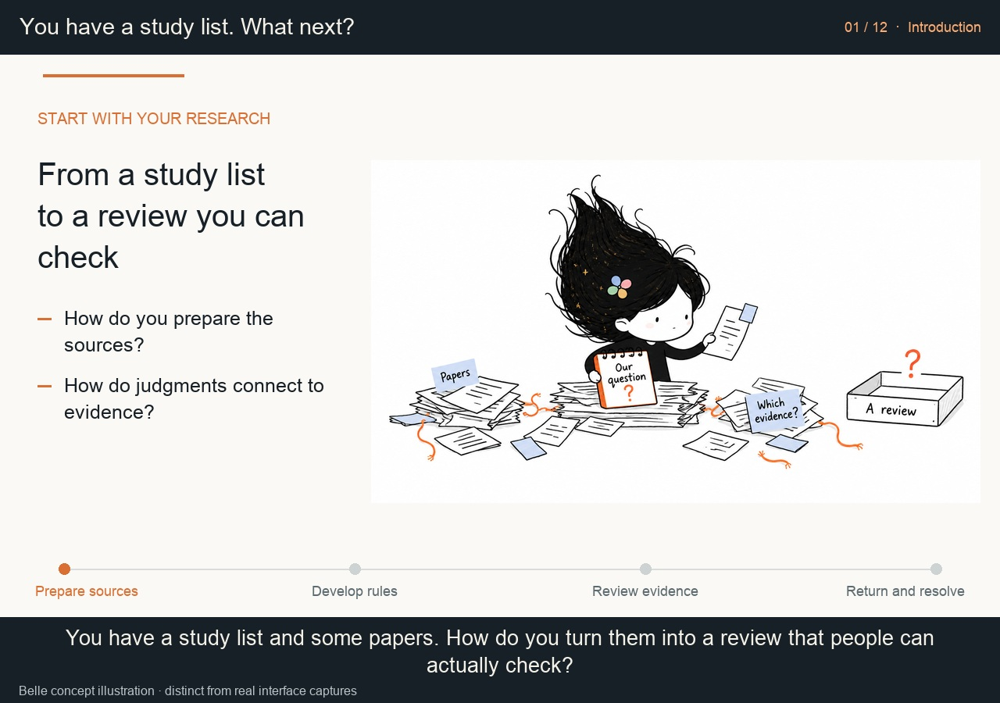

# From a study list to an evidence-linked review

**[▶ English introduction · 4:57](two-skills-introduction.en.mp4)** · [Direct download](https://github.com/Beeeeeeelle/review-evidence-workflow/releases/download/v1.2.0/two-skills-introduction.en.mp4) · [中文 · 5:04](README.zh-CN.md)

[](two-skills-introduction.en.mp4)

New to these skills? Start here. The film begins with a study list and some PDFs, then follows source preparation, human access steps, codebook development, review packages, returns and adjudication. Twelve chapters and 27 guided beats explain what the agent prepares and where people contribute.

For individual controls, continue to **[the actual Pilot workbench tour](../demo/README.md)**, available in English and Chinese. The introduction explains the whole process; the workbench tour shows what to do once you open a package.

## Follow one round

| Your question | What you will see |
|---|---|
| What does each skill do? | PDF Retrieval prepares sources; Review Evidence Workflow organizes review. Use either or both |
| What should I bring? | Question, study list, existing PDFs and current rules; drafts are welcome |
| What if a PDF is hard to find? | Metadata enrichment, retained failed attempts and routes adapted to observed access |
| When do I help? | Specific sign-in, authentication, save and return steps, followed by resumed checking |
| Can coding start after download? | Identity, version and completeness require evidence; uncertainty stays visible |
| Who develops the codebook? | People choose calibration samples and rounds, then develop the rules |
| Must reviewers see AI proposals? | Choose assisted verification or independent blank forms for each round |
| How do I check evidence? | Real Pilot page links, quotation location and a reasoned revision |
| Can people have different tasks? | Personal reports, fields, instructions and modes, configured by the agent |
| Who decides after returns arrive? | The agent organizes differences; people adjudicate and inspect affected work after changes |
| Can my project reuse this? | TALL and Agency illustrate different units; new projects define their own rules |
| How do I start now? | Installation entry points, fictional demos and adaptable example prompts |

## Your first requests

> Use $literature-pdf-retrieval. Find missing full texts for this list; preserve IDs and originals. Give me a specific access step when my help is needed.

> Use $review-evidence-workflow. Here are the full texts, draft codebook and chosen sample. Prepare review packages and identify gaps and human decisions.

[Install the PDF skill](https://github.com/Beeeeeeelle/literature-pdf-retrieval) · [Install the review skill](../../README.md#try-it) · [Explore a fictional package](../TRY_DEMOS.md)

## Player, captions and provenance

The local player switches between **introduction / workbench** and **English / Chinese**, with clickable chapters. From the repository root:

```bash
python3 docs/demo/serve.py --port 8940
```

Open [the player](http://127.0.0.1:8940/?video=intro&lang=en). On GitHub, use the MP4 playback/download links above; the local server is optional.

Narration is synthetic and captions are embedded. Workflow diagrams are explanatory; R017 is a fictional handoff; the independent form uses fictional data. Actual Pilot captures, attributed case adaptations and Belle concept illustrations are identified separately. This is an edited introduction, not a continuous recording or a newly completed research review. No comparative speed or accuracy effect is claimed.

[Transcript](TRANSCRIPT.en.md) · [SRT captions](two-skills-introduction.en.srt) · [Chapters](chapters.en.json) · [Visual provenance and reproduction](PROVENANCE.md) · [Renderer](tools/render_overview.py)
