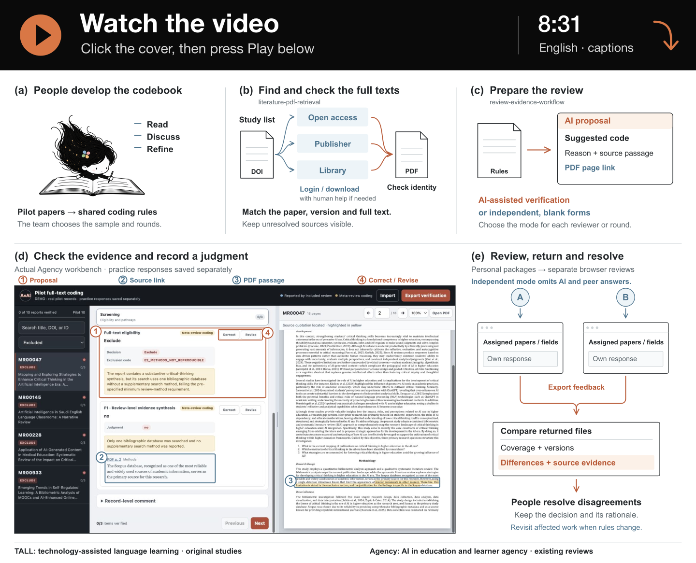

<p align="right"><strong>English</strong> · <a href="README.zh-CN.md">中文</a></p>

# From papers to judgments

## Belle's own walkthrough · English · 8:31

From initial screening to full texts, source checking, team feedback, and the TALL and Agency examples. Narrated by Belle, with English captions visible in the video.

<details>
<summary><picture></picture></summary>

<strong>↓ The player is open below. Press its ▶ button to start watching.</strong>

https://github.com/user-attachments/assets/3285d16d-d72a-48ec-9d7c-1b256f6b8430

</details>

[Transcript, chapters, source notes and offline copies](belle-voice/README.md).

## Earlier bilingual sequence

The following three films remain available in English and Chinese.

## 01 · Why this exists · 1:01

Full-text hunting. Repeated trips back to the source. Different answers from colleagues. The opening brings these problems into view through layered Belle animation, then shows the real Pilot workbench at **0:16**. Watch a page reference lead to evidence, followed by Revise and Correct.

https://github.com/user-attachments/assets/acc855c9-7a52-43a6-8be8-469008d4cb67

[Read the opening transcript](opening/TRANSCRIPT.en.md)

## 02 · Meet the two skills · 4:57

When to use each skill, what to provide, and where people participate.

https://github.com/user-attachments/assets/015182cb-25d4-4a7c-bcbd-29c9b64eb867

[Read the introduction transcript](../intro/TRANSCRIPT.en.md)

## 03 · Inside the workbench · 3:40

A closer walkthrough of screening, coding, verification, page navigation and returns.

https://github.com/user-attachments/assets/1bc47e8e-7276-4822-9731-5e6af63e3d78

[Read the workbench transcript](../demo/TRANSCRIPT.en.md)

<details>
<summary>Need an offline copy? Download the films</summary>

| Film | English | 中文 |
|---|---|---|
| Problem-first opening | [1:01](https://github.com/Beeeeeeelle/review-evidence-workflow/releases/download/v1.2.0/problem-first-opening.layered-v2.en.mp4) | [0:55](https://github.com/Beeeeeeelle/review-evidence-workflow/releases/download/v1.2.0/problem-first-opening.layered-v2.zh-CN.mp4) |
| Meet the two skills | [4:57](https://github.com/Beeeeeeelle/review-evidence-workflow/releases/download/v1.2.0/two-skills-introduction.belle.en.mp4) | [5:04](https://github.com/Beeeeeeelle/review-evidence-workflow/releases/download/v1.2.0/two-skills-introduction.belle.zh-CN.mp4) |
| Inside the workbench | [3:40](https://github.com/Beeeeeeelle/review-evidence-workflow/releases/download/v1.2.0/pilot-guided-walkthrough.belle.en.mp4) | [3:36](https://github.com/Beeeeeeelle/review-evidence-workflow/releases/download/v1.2.0/pilot-guided-walkthrough.belle.zh-CN.mp4) |

</details>

## Optional: one player with chapters and continuous playback

From the repository root:

```sh
python3 docs/watch/serve.py --port 8942
```

[Open the English journey](http://127.0.0.1:8942/?video=opening&lang=en). It starts with the opening. “Continue to the next film” follows it with the introduction and workbench tour; uncheck it to stop after the current film. Chapter buttons, previous/next and language switching remain available. Switching language keeps the corresponding chapter. Optional VTT/SRT captions are included; the default Chinese opening also plays without JavaScript.

## Visuals, evidence and preserved versions

The opening uses [three new Belle concepts and six transparent layers](../../assets/review-opening-belle黑色彗星/README.md). Papers, access obstacles, characters, feedback tokens and paths enter on separate timelines. The character is not regenerated frame by frame. Typography, A/B/Code tokens, circles and paths are editorial graphics.

The real Pilot segment uses unchanged public interface captures, with separate demonstration responses. Camera moves and guidance are editorial; yellow quotation highlights come from the functioning reader. These films use synthetic narration and screenshot sequences, not continuous screen recordings. Source traceability supports human checking, not a guarantee of correctness.

The two detailed Belle films retain their approved narration, chapters and timing. The [original introduction](../intro/README.md) and [original workbench edition](../demo/README.md) are also preserved. TALL and Agency adaptations retain their [provenance](../images/PROVENANCE.md); the independent form uses fictional data and R017 is an illustrative access handoff.

[Opening design and checks](opening/DESIGN.md) · [Earlier visual redesign](DESIGN.md). Rebuild the new opening with `tools/render_opening.py`; its narration and six-chapter metadata are in `opening/`. The renderer uses the same font environment as `tools/render_belle.py`.
