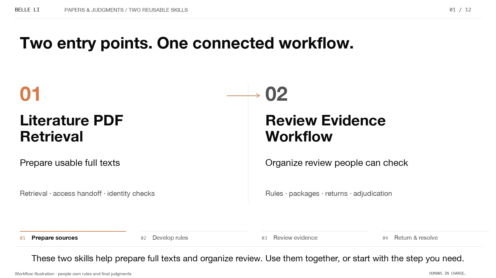

<p align="right"><strong>English</strong> · <a href="README.zh-CN.md">中文</a></p>

# From papers to judgments

The Belle edition brings the introduction and the real workbench tour into one chapter player. Choose a film, select English or Chinese, and start at any chapter. Language switching keeps the corresponding chapter selected. The approved original films remain in [Introduction](../intro/README.md) and [Workbench](../demo/README.md).



| Film | English | 中文 |
|---|---|---|
| Meet the two skills | [Watch · 4:57](https://github.com/Beeeeeeelle/review-evidence-workflow/releases/download/v1.2.0/two-skills-introduction.belle.en.mp4) | [观看 · 5:04](https://github.com/Beeeeeeelle/review-evidence-workflow/releases/download/v1.2.0/two-skills-introduction.belle.zh-CN.mp4) |
| Inside the real workbench | [Watch · 3:40](https://github.com/Beeeeeeelle/review-evidence-workflow/releases/download/v1.2.0/pilot-guided-walkthrough.belle.en.mp4) | [观看 · 3:36](https://github.com/Beeeeeeelle/review-evidence-workflow/releases/download/v1.2.0/pilot-guided-walkthrough.belle.zh-CN.mp4) |

From the repository root, start the local chapter player:

```sh
python3 docs/watch/serve.py --port 8942
```

Open [the English introduction](http://127.0.0.1:8942/?video=intro&lang=en) or [the English workbench tour](http://127.0.0.1:8942/?video=pilot&lang=en). The original player remains available through the **Original edition** link. Native playback controls support seeking, volume and fullscreen; optional WebVTT captions are included. Chapter navigation and language switching need JavaScript, while the default video can play without it.

The edition preserves the original narration, chapter order and timing. It changes composition, type hierarchy, annotation placement and editorial camera movement. The workbench screenshots are authentic; circles, numbered markers, arrows and crops are editorial overlays. Yellow quotation matches come from the functioning PDF reader. Demonstration feedback is separate from research judgments. This is a guided film made from captures, not a continuous screen recording. Narration is synthetic.

TALL and Agency images are real-source adaptations, as described in [image provenance](../images/PROVENANCE.md). The independent form uses fictional data. R017 is an illustrative retrieval handoff. Belle illustrations are reused from the [existing story](../story/README.md).

The original material remains the starting point for the redesign. See [design decisions and QA](DESIGN.md). To reproduce a film, run `tools/render_belle.py` with its approved narration cache (`timeline.json` and `narration.wav`), using `--kind intro|pilot`, `--lang en|zh-CN`, `--build PATH`, and `--out PATH`. Pillow and ffmpeg are required. Font paths can be set with `BELLE_FONT_EN`, `BELLE_FONT_ZH` and `BELLE_MONO`; the default fonts are macOS Helvetica Neue, Hiragino Sans GB and Menlo. The earlier render tools produce the narration caches. Existing screenshots and codebook content are not regenerated.
