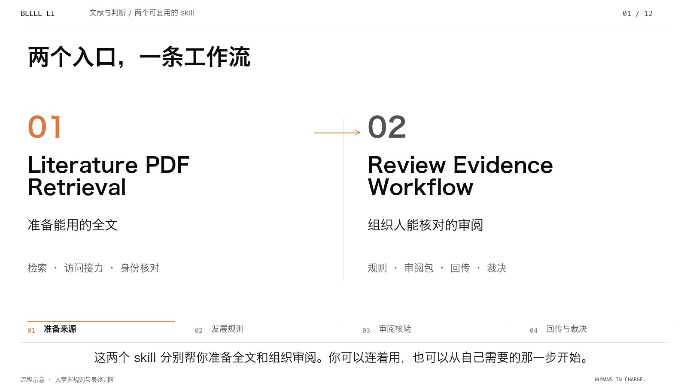

<p align="right"><a href="README.md">English</a> · <strong>中文</strong></p>

# 从文献出发，让判断有据可查

Belle 版把入门导览和真实工作台演示放在同一个播放器里。先选视频，再选中文或英文，也可以直接跳到想看的章节。切换语言会保留对应章节。原来的[入门视频](../intro/README.zh-CN.md)和[工作台视频](../demo/README.zh-CN.md)完整保留。



| 视频 | 中文 | English |
|---|---|---|
| 认识两个 skill | [观看 · 5:04](https://github.com/Beeeeeeelle/review-evidence-workflow/releases/download/v1.2.0/two-skills-introduction.belle.zh-CN.mp4) | [Watch · 4:57](https://github.com/Beeeeeeelle/review-evidence-workflow/releases/download/v1.2.0/two-skills-introduction.belle.en.mp4) |
| 跟着真实工作台走一遍 | [观看 · 3:36](https://github.com/Beeeeeeelle/review-evidence-workflow/releases/download/v1.2.0/pilot-guided-walkthrough.belle.zh-CN.mp4) | [Watch · 3:40](https://github.com/Beeeeeeelle/review-evidence-workflow/releases/download/v1.2.0/pilot-guided-walkthrough.belle.en.mp4) |

在仓库根目录启动：

```sh
python3 docs/watch/serve.py --port 8942
```

打开[中文入门导览](http://127.0.0.1:8942/?video=intro&lang=zh-CN)或[中文工作台演示](http://127.0.0.1:8942/?video=pilot&lang=zh-CN)。页面右上方的“保留的旧版”可以回看原来的版本。

可以点击章节、使用上一章／下一章，或通过视频自带的控件拖动进度、调音量和全屏。附有可选字幕文件，方便使用播放器自己的字幕显示。章节跳转与语言切换需要 JavaScript；默认视频本身仍可直接播放。

新版保留了解说、章节顺序和时长，重新处理了排版、字体、标注位置和镜头移动。真实界面截图没有重绘：圈线、编号、箭头和裁切是后期引导，黄色引文高亮来自实际阅读器。演示反馈与正式研究判断分开保存。这是截图序列制作的导览，使用合成解说，并非连续录屏。

TALL 和 Agency 是注明来源的适配展示，详见[图片来源](../images/PROVENANCE.md)；独立表单使用模拟资料，R017 是找全文时的交接示例。Belle 插画复用[已有的六幕故事](../story/README.zh-CN.md)。

[设计取舍与验收记录](DESIGN.md)说明本次视觉优化。渲染代码在 `tools/render_belle.py`；用旧版工具生成的 `timeline.json` 与 `narration.wav` 可以重新导出对应视频。
