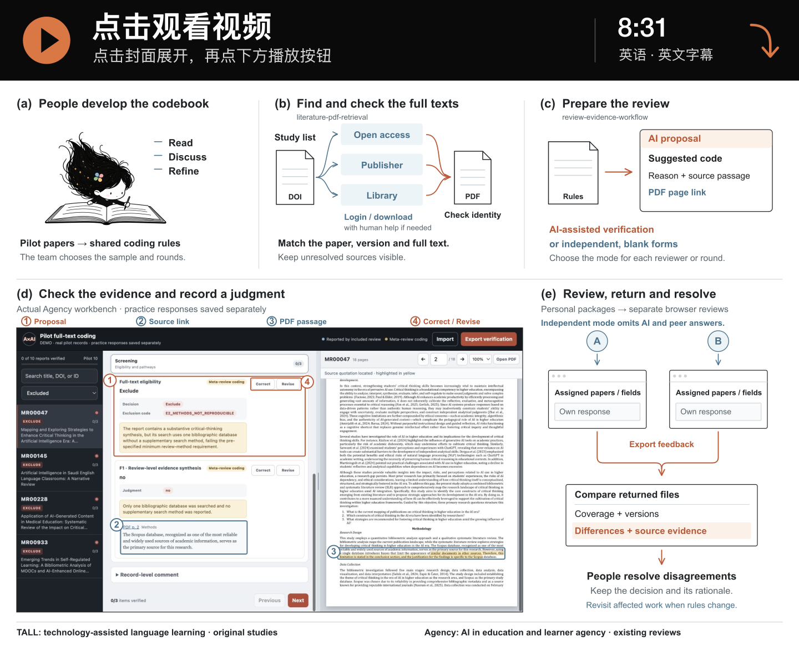

<p align="right"><a href="README.md">English</a> · <strong>中文</strong></p>

# 从文献出发，让判断有据可查

## Belle 本人讲解 · 英语原声 · 8 分 31 秒

从初筛后找全文，到核对证据、组员回传，再走进 TALL 和 Agency 两个案例。英文字幕直接显示在视频里。点击封面展开播放器，再点播放即可观看。

<details>
<summary><picture></picture></summary>

<strong>↓ 视频已在下方展开，请点播放器里的 ▶ 开始观看。</strong>

https://github.com/user-attachments/assets/3285d16d-d72a-48ec-9d7c-1b256f6b8430

</details>

[讲稿、章节、素材说明与离线文件](belle-voice/README.zh-CN.md)。

## 此前的中英双版视频

下面三个版本继续保留。

## 01 · 为什么需要它 · 0:55

找全文来回换入口，填编码反复翻原文，收到不同反馈又得重新对齐。开场用分层 Belle 动画带出这三个问题，**第 11 秒就进入真实 Pilot 工作台**：点页码找证据，再看人怎样 Revise 或 Correct。

https://github.com/user-attachments/assets/053342e2-b9c2-439d-9d5e-732d117daafc

[阅读开场解说](opening/TRANSCRIPT.zh-CN.md)

## 02 · 认识两个 skill · 5:04

什么时候用、先提供什么材料，以及哪些地方需要人参与。

https://github.com/user-attachments/assets/efba3032-361e-4b46-84ae-61aaa72d460f

[阅读入门解说](../intro/TRANSCRIPT.zh-CN.md)

## 03 · 跟着真实工作台走一遍 · 3:36

进一步看筛选、编码、核验、PDF 翻页与反馈回传。

https://github.com/user-attachments/assets/e597f1ef-8880-42ca-ad89-cf71f6cf5bee

[阅读操作解说](../demo/TRANSCRIPT.zh-CN.md)

<details>
<summary>需要离线观看？下载视频</summary>

| 视频 | 中文 | English |
|---|---|---|
| 从痛点到真实例子 | [0:55](https://github.com/Beeeeeeelle/review-evidence-workflow/releases/download/v1.2.0/problem-first-opening.layered-v2.zh-CN.mp4) | [1:01](https://github.com/Beeeeeeelle/review-evidence-workflow/releases/download/v1.2.0/problem-first-opening.layered-v2.en.mp4) |
| 认识两个 skill | [5:04](https://github.com/Beeeeeeelle/review-evidence-workflow/releases/download/v1.2.0/two-skills-introduction.belle.zh-CN.mp4) | [4:57](https://github.com/Beeeeeeelle/review-evidence-workflow/releases/download/v1.2.0/two-skills-introduction.belle.en.mp4) |
| 跟着真实工作台走一遍 | [3:36](https://github.com/Beeeeeeelle/review-evidence-workflow/releases/download/v1.2.0/pilot-guided-walkthrough.belle.zh-CN.mp4) | [3:40](https://github.com/Beeeeeeelle/review-evidence-workflow/releases/download/v1.2.0/pilot-guided-walkthrough.belle.en.mp4) |

</details>

## 可选：用一个播放器连续看，并按章节跳转

在仓库根目录启动：

```sh
python3 docs/watch/serve.py --port 8942
```

[打开中文完整导览](http://127.0.0.1:8942/?video=opening&lang=zh-CN)，默认从新开场开始。勾选“连续看下一段”，会依次接上入门介绍和工作台演示；取消勾选，就停在当前视频。

仍可点击章节、使用上一章／下一章，或切换语言并保留对应章节。视频自带音量、进度和全屏控件，另附可选 VTT/SRT 字幕。章节与语言切换需要 JavaScript；默认中文开场本身仍可直接播放。

## 画面来源与保留的版本

新开场使用[三张 Belle 概念图与六个透明图层](../../assets/review-opening-belle黑色彗星/README.md)。文献、访问障碍、Belle、反馈便签分别进入，连线随后展开；角色不会逐帧重新生成。文字、A/B/Code 便签、圈线是后期引导元素。

真实 Pilot 部分使用已有公开界面截图，演示反馈单独保存。镜头移动、圈线和标注是后期引导，黄色引文高亮来自实际阅读器。视频采用合成解说与截图序列，并非连续录屏。可追溯是为了方便人核查，不代表答案自动正确。

后两段 Belle 视频的解说、章节和时长保持原样；更早的[入门视频](../intro/README.zh-CN.md)与[工作台视频](../demo/README.zh-CN.md)也完整保留。TALL 与 Agency 的适配展示保留[来源说明](../images/PROVENANCE.md)；独立表单使用模拟资料，R017 是访问交接示例。

[新开场的设计与检查](opening/DESIGN.md) · [此前的视觉优化](DESIGN.md)。新开场渲染代码为 `tools/render_opening.py`，讲稿和六章元数据放在 `opening/`。
