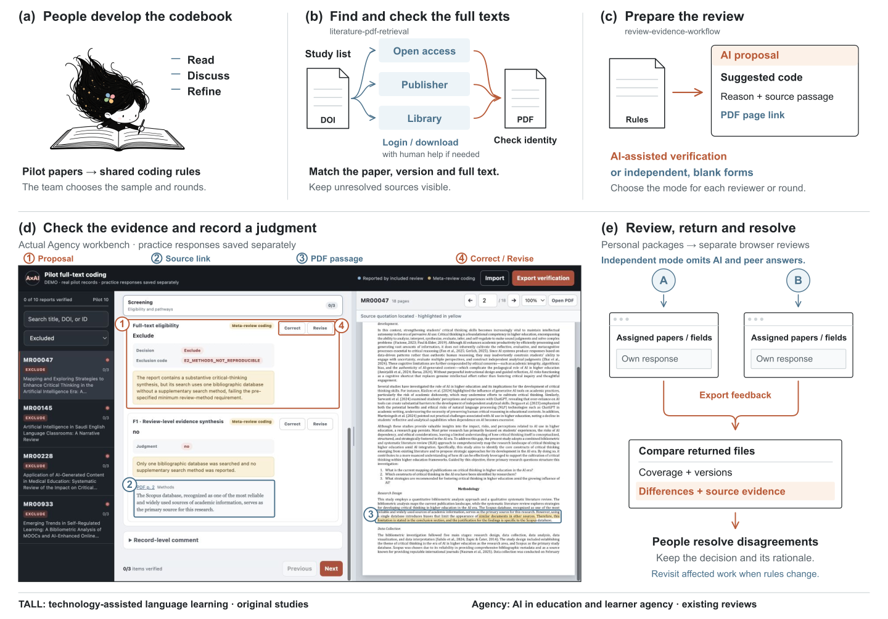

<strong>English</strong> · <a href="README.zh-CN.md">中文说明</a>

# From papers to decisions — with Belle

**Belle explains the two skills in her own voice · English · 8:31.**

After title-and-abstract screening, how do you find the full texts, apply your codebook, coordinate colleagues and check AI's work? This walkthrough starts with those tasks, shows a real example, then explains how the workflow works through the TALL and Agency projects.

Click the cover below to open the inline player, then press Play. English captions are included in the picture, so they also appear in GitHub's player.

<strong>▶ Click the cover to open the video · Belle’s walkthrough · 8:31</strong> <picture></picture>

https://github.com/user-attachments/assets/3285d16d-d72a-48ec-9d7c-1b256f6b8430

## Three parts

| Start | What you will see |
|---|---|
| 0:00 | The review problems, checking AI's answers, and a real evidence example |
| 2:08 | Finding/checking PDFs, human access handoffs, codebook development, two review modes, assignments and returned feedback |
| 5:18 | The actual workbench: screening, source-page links, PDF controls, Correct/Revise, completion, and the TALL and Agency cases |

Use the video's progress bar to seek. [Full transcript](TRANSCRIPT.en.md) · [Detailed scene times](timeline.json) · [SRT](captions.en.srt) · [WebVTT](captions.en.vtt).

## Try the skills

- [Literature PDF Retrieval](https://github.com/Beeeeeeelle/literature-pdf-retrieval): find and identity-check full texts; adapt to available access and hand off specific actions to people.
- [Review Evidence Workflow](../../../README.md): prepare source-linked coding or independent review packages, organize returns and keep human judgments traceable.

## Copies and source notes

[Download the captioned video](https://github.com/Beeeeeeelle/review-evidence-workflow/releases/download/belle-voice-2026-09-25/from-papers-to-decisions-belle.captioned.en.mp4) · [Download the original layout with selectable subtitles](https://github.com/Beeeeeeelle/review-evidence-workflow/releases/download/belle-voice-2026-09-25/from-papers-to-decisions-belle.mp4) · [Release](https://github.com/Beeeeeeelle/review-evidence-workflow/releases/tag/belle-voice-2026-09-25). Subtitle support in the original MP4 depends on the player; the captioned edition always displays the text.

The complete original voice, pace and pauses are preserved. The pictures combine layered illustrations, diagrams and authentic interface captures. Captures are edited into guided state changes, not continuous mouse recordings. Practice fixtures, demonstration responses and real-source case adaptations remain identified; article quotations and the reader's existing highlights are unchanged. [Source and production notes](PROVENANCE.md).

[Earlier English and Chinese films](../README.md) remain available. This original-voice edition does not replace them.
